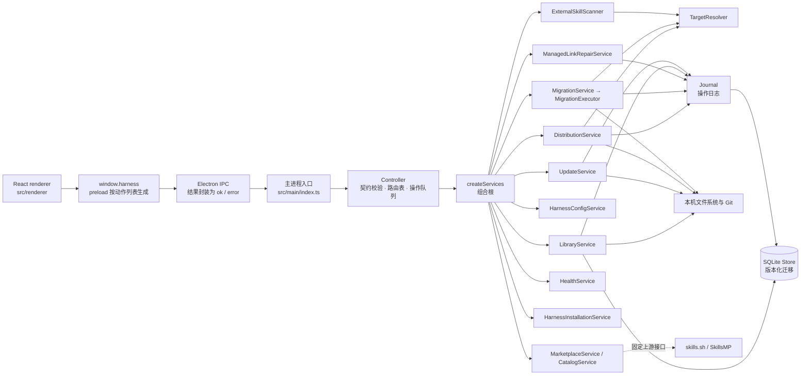

# 架构说明

Harness Manager 把界面与本机文件操作分在不同进程。React 渲染进程只调用 preload 暴露的窄 API；Electron 主进程校验调用、执行业务服务，并持有 SQLite 与文件系统访问能力。

## Electron 进程与 API 边界

`src/main/index.ts` 创建窗口、注册唯一的 IPC 通道，并在应用关闭时等待控制器完成队列后关闭数据库。生产窗口启用 `contextIsolation`、关闭 Node 集成并使用 sandbox。主进程只接受当前窗口主 frame 且匹配可信 renderer URL 的请求。对话框、系统浏览器、访达和废纸篓等操作通过注入的 `PlatformPorts` 执行，不在入口文件里按动作分支。

IPC 的单一来源是 `src/shared/ipc-contract.ts`：每个动作一份 Zod 输入 schema 和一个输出类型。

- `src/shared/ipc-actions.ts` 列出全部动作名，不依赖任何运行库；preload 据此生成 `window.harness` 的方法。
- renderer 使用的 `HarnessAPI` 类型由契约推导；契约中缺少或多出动作都会编译失败。
- `src/main/routes.ts` 为每个动作声明处理函数、是否进入状态队列（`queue`），以及完成后是否通知界面刷新（`mutates`）。
- `Controller.invoke` 统一执行：按契约校验输入 → 查路由 → 需要时排队 → 需要时通知刷新。

校验只在这个边界做一次。服务不再重复检查输入形状，只保留规范化（去重、trim、路径解析）和领域规则（路径包含、归属、重名、内置 Harness 锁定、持久化数据的不变量）。输入限制集中在 `src/shared/limits.ts`。

控制器把状态读取、预览和写入放入单一操作队列，避免并发操作观察到半完成状态。市场目录请求、安装检测、目录选择对话框和技能更新检查不写入 SQLite 状态，在队列外执行，以免网络请求阻塞其他操作；执行更新仍进入队列。文件观察器发现中央库内容变化后，会安排健康检查并通知界面刷新。

## 错误

主进程抛出的错误都是带稳定错误码的 `AppError`，文案集中在 `src/main/messages.ts`：`appError(code, params)` 用于抛出，`message(code, params)` 用于操作结果和日志里的文本。代码和测试只比较错误码，改文案不会影响逻辑。

IPC 返回 `{ ok: true, value }` 或 `{ ok: false, error: { code, message } }`，preload 收到错误后只用中文文案重新抛出，避免界面显示 Electron 的 `Error invoking remote method …` 前缀。契约校验失败使用 Zod 的中文语言包，错误码为 `INVALID_REQUEST`。

## 服务职责

`src/main/services.ts` 的 `createServices()` 是组合根：迁移数据库、同步内置 Harness，并装配下列服务。控制器和测试都用它创建服务。

- `LibraryService`（`library.ts`）扫描 GitHub 或本地来源、校验技能清单、把选定内容导入中央库，并管理来源、分组和界面偏好。GitHub 来源由 Git 检出到临时目录，扫描不执行仓库脚本；放弃的扫描会话最多保留 16 个、30 分钟，过期时删除临时检出。
- `UpdateService`（`updates.ts`）检查已导入技能的来源是否有更新，并按用户确认替换中央库内容。GitHub 来源先用 `git ls-remote` 比较各技能记录的 commit，远端有变化时才浅检出；本地来源直接读取原目录。上游内容哈希与技能的 `baseHash` 比较，中央库内容与 `baseHash` 不同即视为本地修改。检查不写入中央库和 SQLite，结果在内存中保留 2 小时，只有最新一次检查可以执行。执行前重新核对中央库和上游内容，整个目录经暂存替换，更新后记录新的基线和 commit；替换本地修改需要用户逐项确认，修改前的版本移到系统废纸篓。上游改名、清单无效的技能只提示，不自动更新。
- `HarnessConfigService`（`harness-config.ts`）保存内置和自定义 Harness、切换启用状态，并在每次启动时按注册表同步内置记录。
- `TargetResolver`（`targets.ts`）把 Harness 目录解析为规范化的目标，判断哪些目录允许写入，并处理共享目录与停用 Harness 的关系。
- `DistributionService`（`distribution.ts`）负责应用预览、应用和移除，以及这两类操作的恢复。单个入口的所有权与内容检查在 `entries.ts`。
- `HealthService`（`health.ts`）刷新中央库哈希和每个受管入口的健康状态。
- `ExternalSkillScanner`（`external-skills.ts`）列出 Harness 目录中未受管的技能，并计算每个 Harness 实际能看到哪些技能。
- `MigrationService`（`migration.ts`）生成外部技能迁移的预览和同意令牌，执行前再次比较源内容和配置引用；确认后交给 `MigrationExecutor`（`migration-executor.ts`）改链、清理旧来源，并负责迁移的恢复。
- `ManagedLinkRepairService`（`repair.ts`）只修复有管理记录且确认偏离中央库的受管软链接；修复不会删除外部真源。
- `HarnessInstallationService`（`harness-installation.ts`）检测可执行文件、版本、应用包或扩展身份，并为符合条件的残留目录提供单独清理预览。仅凭技能目录存在不会推断工具已安装。
- `MarketplaceService`（`marketplaces.ts`）持久化内置和自定义市场入口；`MarketplaceCatalogService`（`marketplace-catalog.ts`）是独立的目录适配器，只请求固定的 skills.sh 与 SkillsMP 上游地址。

Harness 的每个字段在 `src/shared/harness-fields.ts` 中归入一组：目录与兼容规则、产品身份、本机检测路径。内置 Harness 的锁定字段、检测缓存的失效判断都由这份列表推导；新增字段而不归组会编译失败。

## 持久化模型

`Store`（`store.ts`）使用 Node 内置 `node:sqlite`。数据库文件 `manager.sqlite` 有一张按 `collection` 与 `id` 区分记录的表，记录值以 JSON 存储；同步事务只用于元数据操作。默认库根目录为 Electron `userData/library`，可通过 `HARNESS_LIBRARY_ROOT` 为开发或测试指定隔离位置。

数据格式有版本号，保存在 SQLite 的 `user_version` 中。`migrations.ts` 按顺序列出迁移，`Store.migrate` 在启动时执行尚未应用的迁移：每个迁移与版本号在同一事务中提交，失败时停在上一个完成的版本。非空的库在迁移前先用 `VACUUM INTO` 备份为 `manager.sqlite.bak-v<旧版本>-<时间>`。已发布的迁移不能修改，只能追加。按注册表同步内置 Harness 不属于迁移，每次启动都会执行。

技能实体内容放在库根目录下的 `skills/<skill-id>/<skill-name>`。来源记录保存仓库或本地路径、ref 和解析到的 commit；分组只保存技能 ID 列表，不拥有技能文件。其他主要记录包括 `harnesses`、`workspaces`、`targets`、`bindings`、`intents`、`distributions`、`marketplaces` 和 `operations`。

安装关系分为几层：

1. **Harness** 描述一个工具支持的用户级、工作区级技能入口和兼容规则。
2. **Target** 表示规范化后的物理目录。同一个物理目录被多个 Harness 使用时可以共用 target。
3. **Binding** 表示某 Harness 在某作用域使用某 target；这是逻辑关系。
4. **Intent** 表示用户希望该 binding 提供哪些中央技能。
5. **Distribution** 记录实际入口、软链接或复制策略，以及最后写入哈希和健康状态。

这个模型可以分别表达“共享了一个物理目录”和“两个工具各自有安装意图”，不会因共享路径而复制技能实体。

## 文件操作与恢复

涉及多个文件系统步骤的导入、应用、移除、迁移和修复，都先在操作日志（`operations`）中记录阶段，再做下一步磁盘改动。`Journal`（`journal.ts`）统一负责日志记录的读写、`updatedAt` 时间戳、界面显示的待处理问题，以及清理 30 天前已提交或已失败的记录；`blocked` 记录需要用户处理，不会自动清理。各服务仍保留自己的恢复算法，启动时按导入、技能更新、链接修复、应用/移除、迁移的顺序恢复。技能更新按磁盘状态恢复：旧内容已移出而新内容未放入时放回旧内容，新内容已就位时补记基线，无法判断时标记为待处理并保留旧版本路径。

执行时会检查路径归属、软链接目标、内容哈希和用户修改，避免覆盖未受管内容。跨目录文件操作不等于一个 SQLite 事务，也不保证多个目标同时成功或任意断电场景下全有或全无；界面按项报告部分失败。`tests/recovery.test.ts` 在每个日志阶段模拟进程崩溃，再以新实例执行启动恢复，固定了这些行为。

规划应用时，`DistributionService` 在单次请求内缓存路径解析结果，并按 target 建立 distribution 索引，用于匹配已存储的记录。每次改名前的复查（入口本身、所有权和日志路径）始终重新解析磁盘路径，不使用缓存。

外部技能迁移会收集已配置 Harness 入口及已登记工作区中可识别的引用。独立停用的 Harness 仍引用旧真源时，迁移会阻止清理；仅因兼容规则读取同一个物理入口，不会替停用的 Harness 新建安装意图。范围外未登记的入口不保证自动改链。

启用开关控制 Harness Manager 当前管理哪些 Harness，不会改变工具本身的发现规范。停用不会删除文件、链接、绑定、意图或设置。应用、移除、修复、迁移和清理等写入路径会重新检查启用状态；安全引用检查仍考虑停用 Harness 的独立路径。

## 健康检查

`checkHealth` 重新计算中央库哈希，校验每个受管入口，只写回有变化的记录，并在同一个事务中提交。窗口获得焦点或系统唤醒时调用 `Controller.refreshHealth`：文件观察器正常工作时，中央库的变化已由它触发检查，因此这里不再重新计算哈希；观察器退化为轮询时执行完整检查。用户手动触发的检查始终是完整检查。

## 市场目录

自定义市场来源只代表可打开的网站地址，不意味着应用已实现其目录协议。内置目录适配器固定连接 skills.sh 和 SkillsMP，从返回数据提取可信 GitHub 仓库与技能目录，再交给现有 Git 扫描、候选选择和中央库安装流程。渲染进程不能指定任意目录服务 URL。适配器限制响应大小、请求时间、缓存和重定向，只解析响应数据，不执行远端脚本。

## 渲染进程

`src/renderer/App.tsx` 只负责组合各功能 hook 并渲染布局：

- `hooks/` 中每个 hook 负责一类状态与操作：`useShell`（当前页面、对话框、忙碌任务、共享错误与提示）、`useLibraryData`（快照与偏好）、`useLibraryView`（分类、搜索、折叠和多选）、`useUpdates`（更新检查、“可更新”视图及其独立选择），以及来源导入、应用、Harness 编辑、迁移、市场设置、工作区等流程。
- `pages/` 是各页面，`dialogs/` 是各对话框，`components/` 是共享组件。
- 界面按共享的 `isHarnessEnabled` 过滤已启用 Harness，与主进程使用同一规则；设置页使用未过滤的完整快照。

## 主要入口文件

- 进程与安全边界：`src/main/index.ts`、`src/main/preload.ts`、`src/main/controller.ts`
- IPC 契约与路由：`src/shared/ipc-contract.ts`、`src/shared/ipc-actions.ts`、`src/main/routes.ts`
- 公共数据模型与限制：`src/shared/types.ts`、`src/shared/limits.ts`、`src/shared/harness-fields.ts`
- Harness 规则与路径计算：`src/shared/harness-registry.ts`、`src/shared/harness-paths.ts`
- 组合根、存储与日志：`src/main/services.ts`、`src/main/store.ts`、`src/main/migrations.ts`、`src/main/journal.ts`
- 中央库、更新与分发：`src/main/library.ts`、`src/main/updates.ts`、`src/main/distribution.ts`、`src/main/targets.ts`、`src/main/entries.ts`
- 迁移、修复和安装检测：`src/main/migration.ts`、`src/main/migration-executor.ts`、`src/main/repair.ts`、`src/main/harness-installation.ts`
- 错误文案：`src/main/messages.ts`、`src/shared/errors.ts`
- 市场入口与目录：`src/main/marketplaces.ts`、`src/main/marketplace-catalog.ts`
- 用户界面：`src/renderer/App.tsx` 及 `hooks/`、`pages/`、`dialogs/`、`components/`
